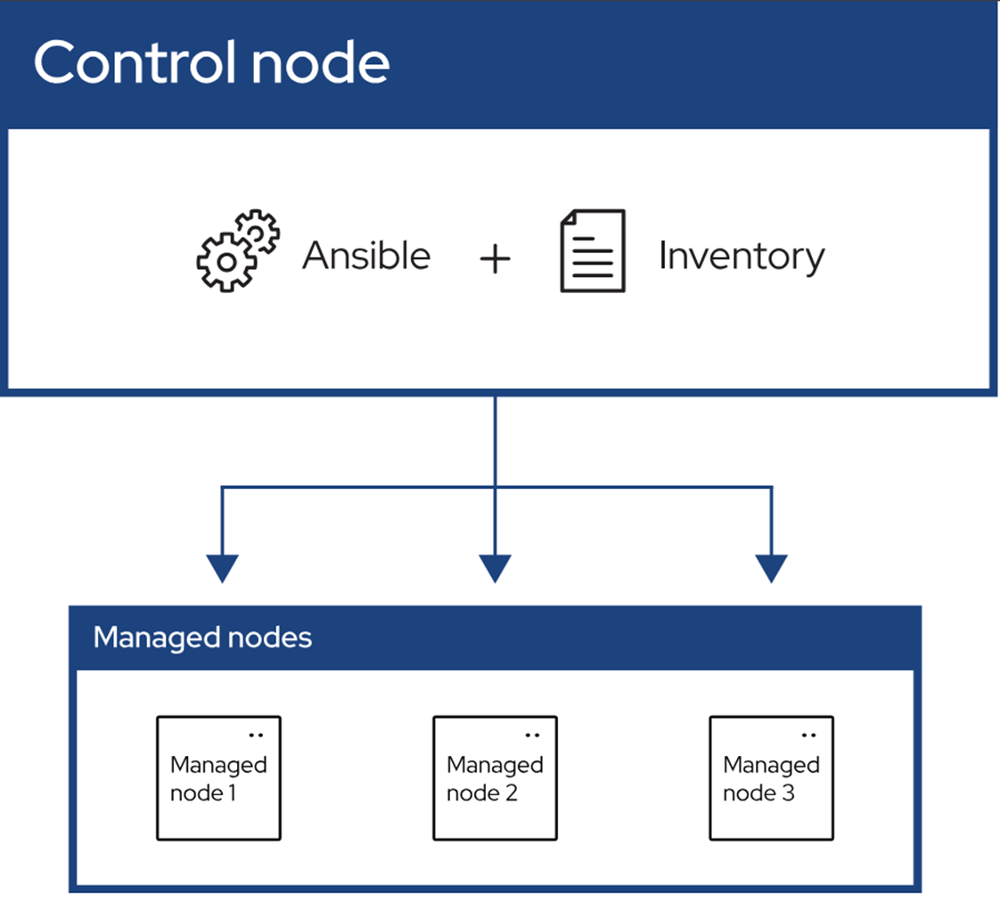

# Ansible
### Ansible (Configuration Management and Deployment) - Oracle VM VirtualBox - Linux (Ubuntu, CentOS), Nodes



####  Ansible
https://docs.ansible.com/ansible/latest/getting_started/index.html#extpack


####  Oracle VirtualBox
https://www.oracle.com/virtualization/technologies/vm/downloads/virtualbox-downloads.html#extpack

En son sürüm için bu siteyi de kullanabilirsiniz.
https://www.virtualbox.org/


### MyControlNode makinesi  - CentOS makine
```
su root
yum update -y 
```


PUBLIC_IP numarasını göreceğiz.
```
ifconfig
```

```
su root
dhclient
onboot=yes
yum update -y 
reboot
```

Makine açılınca IP'yi kontrol et.
```
su root
yum install epel-release -y
yum install net-tools 
ifconfig
```

```
su root
yum update -y 
yum install openssh-server -y

systemctl status firewalld
systemctl stop firewalld
systemctl disable firewalld
systemctl status firewalld
```

```
su root
ssh-keygen
```

Sadece ana makineye Ansible kuruyoruz.
```
yum install ansible-core
ansible --version
```


Burada bu komutu çalıştırmadım ama ihtiaç olursa hostname vermek için kullanabilirsiniz.

```
su root
hostnamectl set-hostname control-node
cat /etc/hostname
reboot
```


## Makine managed-node1  - CentOS makine
```
su root
yum update -y 

systemctl status firewalld
systemctl stop firewalld
systemctl disable firewalld
systemctl status firewalld

hostnamectl set-hostname managed-node1
cat /etc/hostname
reboot
```


```
su root
ssh-keygen
```


## Makine managed-node2  - CentOS makine
```
su root
yum update -y 

systemctl status firewalld
systemctl stop firewalld
systemctl disable firewalld
systemctl status firewalld

hostnamectl set-hostname managed-node2
cat /etc/hostname
reboot
```


```
su root
ssh-keygen
```


ControlNode makinesindeyiz.

ControlNode makinesinden ManagedNode1 makinesini kullanmak için 

İlk bağlantıyı bu komutla gerçekleştir.
```
ssh-copy-id root@ManagedNode1MakinesininPublicIPsi
```

Sonraki bağlantıları da bununla yap.
```
ssh         root@ManagedNode1MakinesininPublicIPsi
```


İlk bağlantıyı bu komutla gerçekleştir.
```
ssh-copy-id root@ManagedNode2MakinesininPublicIPsi
```


Sonraki bağlantıları da bununla yap.
```
ssh         root@ManagedNode2MakinesininPublicIPsi
```


SSH ile bu makineden bağlantı kurduğum makinelerin bilgileri burada tutulur.
```
cd /root/.ssh

cat known_hosts

cat id_ed25519.pub
```

Terminalde yazan satırı kopyalıyoruz.

```
ssh-ed25519 ABCABCABCABCABCABCABCABCABCABCABCABCABCABC root@localhost.localdomain
```


Node1 ve Node2 makinelerine Control makinesini tanıtacağız.

```
cd /root/.ssh
```

```
nano authorized_keys 
```
veya   
```
vi authorized_keys  
```
komutuyla açacağız.


ControlNode makinesinden gelen bu bilgiyi authorized_keys dosyasının içine yapıştırıp kaydet.
```
ssh-ed25519 ABCABCABCABCABCABCABCABCABCABCABCABCABCABC root@localhost.localdomain
```


#### ControlNode makinesine geç ve Ansible ayar dosyasını aç.
```
cat /etc/ansible/hosts
```

Ansinle hosts dosyasını ister nano ile ister vi ile aç
```
nano /etc/ansible/hosts 
```
veya   
```
vi /etc/ansible/hosts  
```


Ansible'ın yöneteceği makineleri kendimize göre grupluyoruz.
mynodes, mynode1, mynode2, mynode3  grup isimleridir.
Grup isimlerine istediğiniz isimleri verebilirsiniz.
```
[mynodes]
192.168.11.11
192.168.11.22
192.168.11.33

[mynode1]
192.168.11.11


[mynode2]
192.168.11.22


[mynode3]
192.168.11.99
```


Ansible komutları


        [pattern] [module] [module options]
```
ansible            -m        ping  all
ansible            -m        ping  mynode5


```


Bütün managed node makinelerini yeniden başlattı. 
```
ansible all -a "/sbin/reboot"
```


Sadece node1 için ping atacağız.
```
ansible            -m        ping    mynode1
```

### Makine managed-node3  - Ubuntu makine 
```
sudo su

apt update

apt upgrade  -y

nano /etc/hostname

hostnamectl set-hostname managed-node3
cat /etc/hostname
reboot


sudo su

apt install openssh-server -y

ssh-keygen

systemctl status ssh
systemctl start ssh


ifconfig

apt install net-tools

ifconfig


reboot
```


#### ControlNode makinesinin terminaline git. 
En yetkili admin yani kök kullanıcı ol.
```
su root
```

ControlNode makinesinden gelen public anahtar bilgisini terminalden oku.
```
cat id_ed25519.pub
```

Terminaldeki bu public anahtarı kopyala.
```
ssh-ed25519 ABCABCABCABCABCABCABCABCABCABCABCABCABCABC root@localhost.localdomain
```


Şimdi ManagedNode'a gidiyoruz.
#### Ubuntu makinesine geç.
ControlNode makinesinden gelen public anahtarı Node3 Ubuntu makinesine gireceğiz.
Böylece Node3 Control makinesini tanıyacak.

```
cd /root/.ssh
```

ControlNode makinesinden gelen public anahtar bilgisini authorized_keys dosyasının içine yapıştırıp kaydet.
```
ssh-ed25519 ABCABCABCABCABCABCABCABCABCABCABCABCABCABC root@localhost.localdomain
```

authorized_keys dosyasını ister nano ile ister vi ile aç
```
nano authorized_keys 
```
veya   
```
vi authorized_keys  
```
komutuyla açacağız.


#### ControlNode makinesine geç ve Ansible ayar dosyasını aç.
```
cat /etc/ansible/hosts
```

Ansinle hosts dosyasını ister nano ile ister vi ile aç
```
nano /etc/ansible/hosts 
```
veya   
```
vi /etc/ansible/hosts  
```


Ansible'ın yöneteceği makineleri kendimize göre grupluyoruz.
mynodes, mynode1, mynode2, mynode3  grup isimleridir.
Grup isimlerine istediğiniz isimleri verebilirsiniz.
```
[mynodes]
192.168.11.11
192.168.11.22
192.168.11.33

[mynode1]
192.168.11.11


[mynode2]
192.168.11.22


[mynode3]
192.168.11.99
```


ControlNode makinesinde 
```
su root
```


Bu kısımda root hakkının yönetim açık olduğunu gör.
```
cat /etc/sudoers
```

Bütün makineleri yokla. Ping atmak.
Komutta all kelimesine dikkat edin. Yeri değişebilir.


        [pattern]  [module]   [module options]
```
ansible            -m  ping    all

ansible  all       -m   ping    
```

Shell üzerinde komut çalıştırmak bir başka makinenin terminalini kullanmak gibidir.
```
ansible  all       -m   shell -a "echo My demo message"    

ansible  mynode1    -m   shell -a "echo My demo message 1"    
```

### Dosya koyalama

Herkesin /tmp klasörünün içine kopyala
```
ansible  mynodes    -m   copy  -a  "src=/etc/ansible/hosts   dest=/tmp/hosts"  
```

Sadece 1. Makinede kopyalama
```  
ansible  mynode1    -m   copy  -a  "src=/etc/ansible/hosts   dest=/tmp/hosts"    
```


ControlNode içinde komutları verirken çalıştığınız konumun bir önemi yok ama bir dosyayı çalıştırıyorsanız o zaman önemi var.

```
cd /tmp
```

Kendimize ait bir tane text dosyası yapalım.
İser vi ister nano kullan.
```
vi   my-lesson-note1.txt
```

```
nano my-lesson-note2.txt
```


Bu dosyayı bütün makinelere kopyala.
```
ansible  mynodes    -m   copy  -a  "src=/tmp/my-lesson-note1.txt   dest=/tmp/MyLessonNote1.txt"  
```


Sadece 1. makineye göndermek istiyoruz.
```
ansible  mynode1    -m   copy  -a  "src=/tmp/my-lesson-note2.txt   dest=/tmp/MyLessonNote2.txt" 
```


komutların uzun hali de kısa hali de aynı işi yapar.
```
ansible  mynode1    -m   ansible.builtin.copy  -a  "src=/tmp/my-lesson-note2.txt   dest=/tmp/MyLessonNote2.txt" 
```


Sadece arge_mynodes grubunun makinelerine kopyala
```
ansible  arge_mynodes    -m   copy  -a  "src=/tmp/my-lesson-note2.txt   dest=/tmp/MyLessonNote4.txt"
```

Dosyayı silmek istiyoruz.

Linux'te sileceğin dosyanın konumuna gidip silersin.
```
rm -f my-lesson-note1.txt
```

Tüm makinelerden bir dosyayı sileceğiz
```
ansible  mynodes    -m   file  -a  "dest=/tmp/MyLessonNote1.txt state=absent"
```


Folder (Klasör)leri kopyalamasını yapalım.
```
su root

cd /tmp

mkdir myFolder

cd /tmp/myFolder

touch  myFile1.txt
touch  myFile2.txt
touch  myFile3.txt
touch  myFile4.txt
```


Bütün makinelere myFolder klasörünü kopyala. İçindekilerle birlikte koyalanır.
```
ansible  mynodes    -m   copy  -a  "src=/tmp/myFolder   dest=/tmp" 
```


Linux makinede bir folder'ı silmek için kullandığım komut.
```
rm -rf myFolder
```


Bütün makinelere myFolder klasörünü sileceğiz içindekilerle birlikte. 
```
ansible  mynodes    -m  file   -a "dest=/tmp/myFolder   state=absent" 
```


Bütün makinelere myFolder klasörünün özellikleri değiştireceğiz. 
```
ansible  mynodes    -m  file   -a "dest=/tmp/myFolder   state=directory" 
```


Sadece yönetilen 1. makinede erişim hakkını tam verdik. 777 
```
ansible  mynode1    -m  file   -a "dest=/tmp/myFolder  mode=777 state=directory" 
```

1. Makineye yeni bir kullanıcı ekleme
```
adduser bulent
adduser sefik
```

1. Makineye yeni bir grup ekleme
```
groupadd satis
groupadd arge
groupadd insankaynaklari
groupadd yazilim
groupadd devops
```


Sadece yönetilen 1. makinede erişim hakkını, grup, sahiplik özelliklerini değiştirdik.
```
ansible  mynode1    -m  file   -a "dest=/tmp/myFolder  mode=777   group=devops   owner=bulent  state=directory" 
``` 


Ansible paket yönetimi
```
ansible  all       -m   yum  -a "name=nano state=present"  -b
```

### Linux makineleri işletim sistemine göre grupalayın 
```
vi /etc/ansible/hosts
```

```
ansible  linux_centos       -m   yum  -a "name=nano state=present"   -b 
ansible  linux_ubuntu       -m   apt  -a "name=nano state=present"   -b 
```
```
[linux_centos]
192.168.11.32
192.168.11.82
192.168.175.129

[linux_ubuntu]
192.168.11.79
192.168.175.128
```


Bu CentOS makinelere nginx kurar.
```
ansible  linux_centos       -m   yum  -a "name=nginx state=present"   -b 
```

Bu CentOS makinelerden nginx'i kaldırır.
```
ansible  linux_centos       -m   yum  -a "name=nginx state=absent"   -b 
```


Ubuntu makinelere kurar 
```
ansible  linux_ubuntu       -m   apt  -a "name=nginx state=present"   -b 
```


Ubuntu makinelerden siler
```
ansible  linux_ubuntu       -m   apt  -a "name=nginx state=absent"   -b 

```

Servisleri yönetmek

Sadece 1. makinede 
```
systemctl status firewalld
```


Servis durumlarını görmek için sadece 1 tane makine seçtim ve state özelliklerini gördüm.
```
ansible  mynode1    -m  service   -a "name=firewalld   state=aaaaaaaaaaaaaaaaaa" 
```


Sadece CentOS makinelerde ateş duvarı servisini açtık.
```
ansible  linux_centos    -m  service   -a "name=firewalld   state=started" 
```


#### Komutların en sonundaki  -b
become yani root, yönetici, admin gibi bu komutu çalıştır anlamına gelir. 
 
 
<hr>

#### ÖDEV: Ubuntudaki firewalld duvarı açmayı araştır. Aşağıdaki komutu Ubuntuya uyarla ve çalıştır. 
```
ansible  linux_ubuntu    -m  service   -a "name=firewalld   state=started"   -b
```

#### Cevap:

<hr>

Önce Ubuntu sistemi güncelle.

```
ansible linux_ubuntu -m shell -a "apt update" -b
```

Ubuntuda olmayan firewalld paketini kur.
```
ansible linux_ubuntu -m apt -a "name=firewalld state=present update_cache=yes" -b
```

firewalld servisini aç.
```
ansible linux_ubuntu -m service -a "name=firewalld state=started enabled=yes" -b
```


<hr>


Sadece CentOS makinelerde ateş duvarı firewalld servisini sadece o an için durduruyoruz. Geçici olarak kapattık.
``` 
ansible  linux_centos    -m  service   -a "name=firewalld   state=stopped"  -b
```

Sadece CentOS makinelerde ateş duvarı firewalld servisini enabled=no  ile tamamen devre dışı bırakıyoruz. Kalıcı olarak kapatıyoruz.
``` 
ansible  linux_centos    -m  service   -a "name=firewalld   state=stopped enabled=no"  -b
```


Sadece Ubuntu makinelerde ateş duvarı firewalld servisini sadece o an için durduruyoruz. Geçici olarak kapattık.
``` 
ansible  linux_ubuntu    -m  service   -a "name=firewalld   state=stopped"  -b
```

Sadece Ubuntu makinelerde ateş duvarı firewalld servisini enabled=no  ile tamamen devre dışı bırakıyoruz. Kalıcı olarak kapatıyoruz.
``` 
ansible  linux_ubuntu    -m  service   -a "name=firewalld   state=stopped enabled=no"  -b
```


Shell sözcüğü ile doğrudan istediğimiz makinelerin termianlinde komutları çalıştırabiliriz.
```
ansible    -m   shell   -a "free -m"      mynode1

ansible    -m   shell   -a "free -m"      all
```

```

ansible    -m   shell   -a "sudo yum install java-21-openjdk -y"    linux_centos

ansible    -m   shell   -a "sudo apt install openjdk-21-jdk -y"    linux_ubuntu
```

```
ansible    -m   shell   -a "sudo yum install nodejs -y"    linux_centos 
```  


## Ansible Playbook

Çalışılacak dizine git. Orada bir klasör oluştur ve içine gir.
```  
cd /opt

mkdir MyAnsible

cd /MyAnsible
```  

Çalışma klasörümüzün içine bir yaml dosyası oluşturuyoruz.
```  
vi 01_my_debugger.yaml
```  


Dosyanın içine yaml formatında komutlarımızı tasklar olarak giriyoruz.

```  
- name: Debugger Demo
  hosts: all
  tasks:
    - name: My execute command for task 1
      command: "true"
      debugger: on_failed
    - name: My execute command for task 2
      command: "true"
      debugger: on_skipped
    - name: My execute command for task 3
      command: "true"
      debugger: on_skipped
```  

Ansinle ile yaml dosyasını çalıştırıyoruz. 

```  
ansible-playbook 01_my_debugger.yaml
```  

<hr>

Çalışma klasörümüzün içine bir yaml dosyası oluşturuyoruz.

serial ile makineleri ikişer üçer gibi yaparak çalıştırabiliriz.

```  
vi 02_my_serial.yaml
```  

Dosyanın içine yaml formatında komutlarımızı tasklar olarak giriyoruz.

```  
- name: Serial Demo
  hosts: all
  serial: 2
  tasks:
    - name: MyTask 1
      command: "echo my task 1"
    - name: MyTask 2
      command: "echo my task 2"
    - name: MyTask 3
      command: "echo my task 3"
```       

Ansinle ile yaml dosyasını çalıştırıyoruz. 
	 
```  	 
ansible-playbook 02_my_serial.yaml
```  


<hr>


Çalışma klasörümüzün içine bir yaml dosyası oluşturuyoruz.

```  
vi 03_my_serial_percent.yaml
```  

Dosyanın içine yaml formatında komutlarımızı tasklar olarak giriyoruz.

serial içine % yüzde verirsek o zaman makine sayısını oranlar ve öyle çalıştırır.

```  
- name: Serial Demo
  hosts: all
  serial: "50%"
  tasks:
    - name: MyTask 1
      command: "echo my task 1"
    - name: MyTask 2
      command: "echo my task 2"
    - name: MyTask 3
      command: "echo my task 3"
```       

Ansinle ile yaml dosyasını çalıştırıyoruz. 
	 
```  	 
ansible-playbook 03_my_serial_percent.yaml
```  

<hr>


Çalışma klasörümüzün içine bir yaml dosyası oluşturuyoruz.

```  
vi 04_my_setup.yaml
```  

Dosyanın içine yaml formatında komutlarımızı tasklar olarak giriyoruz.

become: root, admin en yetkili yönetici anlamlarına gelir.

Burada yum ile sadece CentOS makinelere kurulum yapılır.

Ubuntu için apt kullanılmalı.


```  
- name: Demo Setup
  hosts: all
  become: true
  become_method: sudo
  tasks:
    - name: Install wget
      yum:
        name: wget 
        state: present
```  		
	
Ansinle ile yaml dosyasını çalıştırıyoruz. 
	
```  	
ansible-playbook 04_my_setup.yaml
```  

<hr>


#### Ansible ile CentOS makinelere Maven kurmak

Çalışma klasörümüzün içine bir yaml dosyası oluşturuyoruz.

```  
vi 05-maven.yml
```  

Dosyanın içine yaml formatında komutlarımızı tasklar olarak giriyoruz.

```  
- name: Install Maven
  hosts: mynodes
  become: true
  become_method: sudo
  become_user: root
  user: root
  tasks:
    - name: Download Maven tar
      get_url:
        url: https://downloads.apache.org/maven/maven-3/3.9.11/binaries/apache-maven-3.9.11-bin.tar.gz
        dest: /opt/apache-maven-3.9.11-bin.tar.gz
    
    - name: Create a directory
      file:
        path: /opt/maven
        state: directory
    
    - name: Extract Maven
      command: tar xvf /opt/apache-maven-3.9.11-bin.tar.gz -C /opt/maven
   
    - name: Update Profile
      copy: content="export M2_HOME=/opt/maven/apache-maven-3.9.11 \n" dest=/etc/profile.d/maven.sh
    - lineinfile:
        path: /etc/profile.d/maven.sh
        line: 'export PATH=${M2_HOME}/bin:${PATH}'
    
    - name: Source profile
      shell: source /etc/profile.d/maven.sh
```  

Ansinle ile yaml dosyasını çalıştırıyoruz. 

```  
ansible-playbook  05-maven.yml
```  


<hr>

#### Ansible ile CentOS makinelere Docker kurmak

Daha düzenli olması için çalışma klaösürümüzün içine Docker kurulumu yeni bir klasör daha oluşturup içine girdik. 

Docker klasörünün içine de kurulumunun yaml dosyalarını oluşturacağız.

```  
cd /opt/MyAnsible

mkdir 06_my_docker

cd /06_my_docker
```  

<hr>

#### check Docker


Çalışma klasörümüzün içine bir yaml dosyası oluşturuyoruz.

```  
vi 01-checkDocker.yaml
```  

Dosyanın içine yaml formatında komutlarımızı tasklar olarak giriyoruz.

```  
- name: Check Docker & Docker-compose & Kubectl
  hosts: mynodes
  become_method: sudo
  become_user: root
  become: yes
  gather_facts: no
  tasks:

    - name: Check Docker
      command: docker --version
      ignore_errors: yes
      register: docker_check

    - name: Check Docker-compose
      command: docker-compose --version
      ignore_errors: yes
      register: docker_compose_check

    - name: Check Kubectl
      command: kubectl --version
      ignore_errors: yes
      register: kubectl_check
```  

Ansinle ile yaml dosyasını çalıştırıyoruz. 

```  
ansible-playbook 01-checkDocker.yaml
```  

<hr>

#### remove Docker

Çalışma klasörümüzün içine bir yaml dosyası oluşturuyoruz.

```  
vi 02-removeDocker.yaml
```  
Dosyanın içine yaml formatında komutlarımızı tasklar olarak giriyoruz.

```  
- name: Remove Docker&components
  hosts: mynodes
  become: true
  become_user: root
  become_method: sudo
  tasks:
    - name: Remove Docker
      yum:
        name:
          - docker
          - docker-client
          - docker-client-latest
          - docker-common
          - docker-latest
          - docker-latest-logrotate
          - docker-logrotate
          - docker-engine
          - docker-ce-cli
          - docker-ce
          - docker-selinux
        state: removed
```  

Ansinle ile yaml dosyasını çalıştırıyoruz. 

```  
ansible-playbook 02-removeDocker.yaml
```  

<hr>

#### install Docker

Çalışma klasörümüzün içine bir yaml dosyası oluşturuyoruz.

```  
vi 03-installDocker.yaml
```  
Dosyanın içine yaml formatında komutlarımızı tasklar olarak giriyoruz.

```  
- name: Install Docker Full
  hosts: linux_centos
  become: true
  become_method: sudo
  become_user: root
  tasks:

    - name: Install yum-utils
      yum:
        name: yum-utils
        state: latest

    - name: Install device-mapper-persistent-data
      yum:
        name: device-mapper-persistent-data
        state: latest

    - name: Install lvm2
      yum:
        name: lvm2
        state: latest

    - name: Add Docker Repo
      get_url:
        url: https://download.docker.com/linux/centos/docker-ce.repo
        dest: /etc/yum.repos.d/docker-ce.repo

    - name: Install Docker-ce-cli
      package:
        name: docker-ce-cli-28.5.0
        state: present

    - name: Install Docker-ce
      package:
        name: docker-ce-28.5.0
        state: present
        
    - name: Start Docker Service & Enabled
      service:
        name: docker
        state: started
        enabled: yes
```  

Ansinle ile yaml dosyasını çalıştırıyoruz. 

```  
ansible-playbook 03-installDocker.yaml
```  
